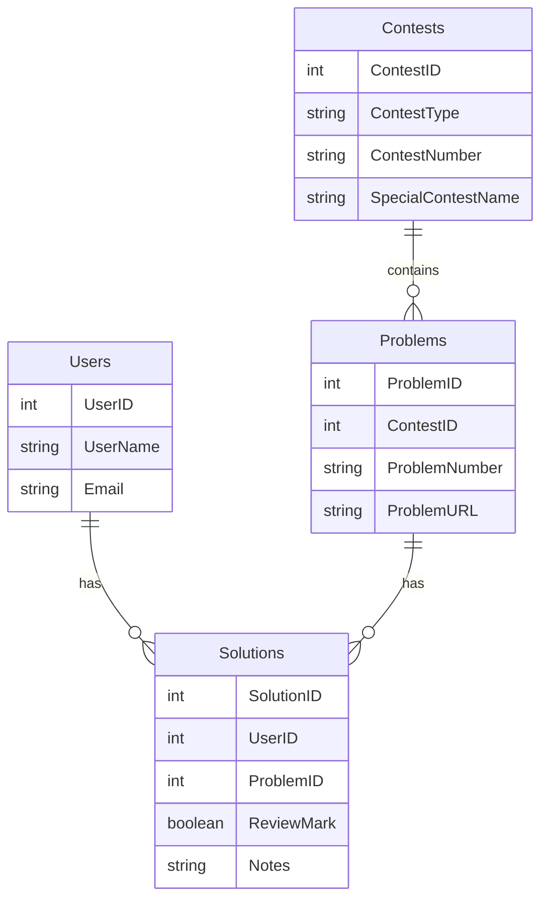

```mermaid

erDiagram
    Users ||--o{ Solutions : has
    Problems ||--o{ Solutions : has
    Contests ||--o{ Problems : contains

    Users {
        int UserID
        string UserName
        string Email
    }

    Solutions {
        int SolutionID
        int UserID
        int ProblemID
        boolean ReviewMark
        string Notes
    }

    Problems {
        int ProblemID
        int ContestID
        string ProblemNumber
        string ProblemURL
    }

    Contests {
        int ContestID
        string ContestType
        string ContestNumber
        string SpecialContestName
    }
```
